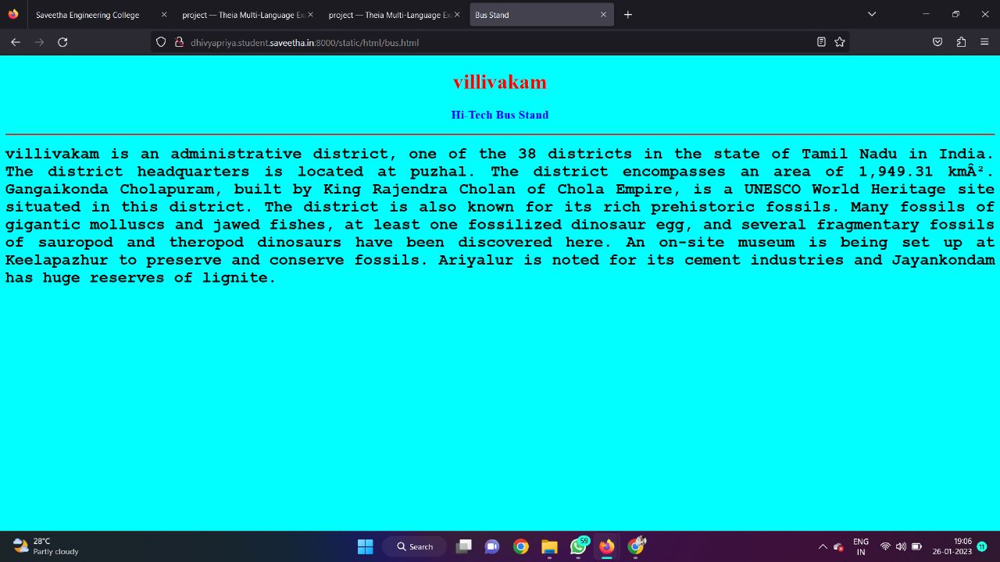

# Places Around Me
## AIM:
To develop a website to display details about the places around my house.

## Design Steps:

### Step 1:
clone the repository.
### Step 2:
start project
### Step 3:
write the html code.
## Code:
<!DOCTYPE html>
<html lang="en">
<head>
<title>My City</title>
</head>
<body>
<h1 align="center">
<b>villivakam</b>
</h1>
<h3 align="center">
<b>dhivya r(22008389)</b>
</h3>

<map name="MyCity">
<area shape="circle" coords="" href="/static/html/ghs.html" title="Govt. Higher Secondary School">
<area shape="rectangle" coords="490,150,870,320" href="/static/html/rto.html" title="RTO Office">
<area shape="circle" coords="400,350,50" href="/static/html/vk.html" title="Puzhal Lake">
<area shape="circle" coords="400,200,75" href="/static/html/bus.html" title="Hi-Tech Bus Stand">
<area shape="rectangle" coords="" href="/static/html/park.html" title="Eco-Park">
</map>

</body>
</html>

## Output:

## Result:
A website to display details about the places around my house was created successfully.